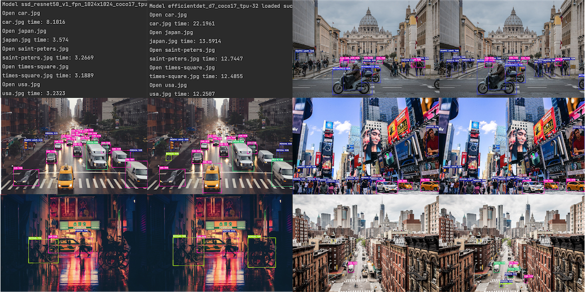

<h1 align="center">Object Detection</h1>

## Description

This small but beautiful project is about object detection using pre-trained models from 
[TensorFlow 2 Model Zoo](https://github.com/tensorflow/models/blob/master/research/object_detection/g3doc/tf2_detection_zoo.md). 
The aim of this project is to lay the foundation of how pre-trained models could be easily deployed and applied to 
other projects. Two models ([RetinaNet50](http://download.tensorflow.org/models/object_detection/tf2/20200711/ssd_resnet50_v1_fpn_1024x1024_coco17_tpu-8.tar.gz) 
and [EfficientDet D7](http://download.tensorflow.org/models/object_detection/tf2/20200711/efficientdet_d7_coco17_tpu-32.tar.gz)) 
were tested on a local machine with the same data sources to compare the differences, e.g. loading time, calculation 
speed, etc. The results aren't to compare which model is better, rather explore the differences of choices. The models 
were tested by using images, a video clip, and a live webcam feed.

[TensorFlow 2 Detection Model Zoo](https://github.com/tensorflow/models/blob/master/research/object_detection/g3doc/tf2_detection_zoo.md) 
is a public repository of large numbers of pre-trained models, made available by Google. The models have been trained 
on the same [COCO 2017](https://cocodataset.org/) dataset.

### Test Parameters

* **Loading Time:** (result) time to load the model
* **Total Time:** (result) accumulated time of the total prediction time over all 5 images
* **Speed (ms):** (source) prediction time per frame
* **COCO mAP:** (source) mean average precision tested on COCO 2017 dataset
* **iou_threshold:** (input) overlapping bbox above this value will be discarded. Calculate by area of overlap / total area
* **score_threshold:** minimum confidence score threshold to keep the bbox
* **max_output_size:** number of maximum bboxes
* **outputs:** boxes of detected objects

### Test Results

|                  Model                  | Loading Time (s) | Total Time (s) | Speed (ms) | COCO mAP |
|:---------------------------------------:|:----------------:|:--------------:|:----------:|:--------:|
| ResNet50 V1 FPN 1024x1024 (RetinaNet50) |     12.9903      |    21.3637     |     87     |   38.3   |
|        EfficientDet D7 1536x1536        |     57.1772      |    73.2684     |    325     |   51.2   |

<small>***All tests are performed on a local machine***</small>

##<b>Features</b>

- Prepare class list of COCO 2017 Dataset
  - load class name into a list as assign a color for each class
- Download and save model from TensorFlow 2 Model Zoo
- Detect object(s) in image(s)
  - Detect object(s)
  - Show the current image with detected object(s)
  - Save the image with the detected object(s) locally   
- Detect object(s) in a video clip
  - Live object(s) detection when playing the video clip
- Detect object(s) live from a webcam feed

###<b>Change Log</b>
* 15.03.2022: First commit